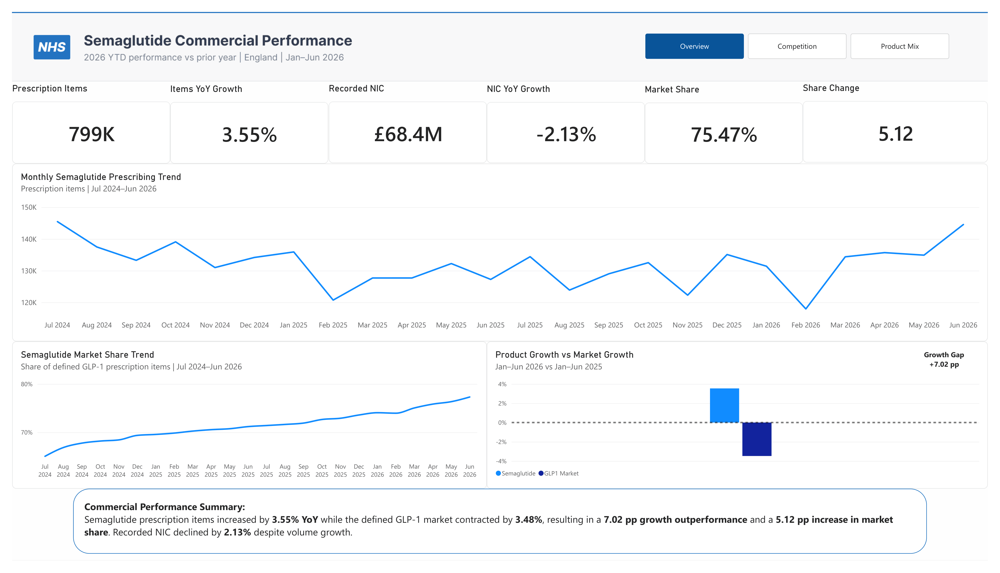
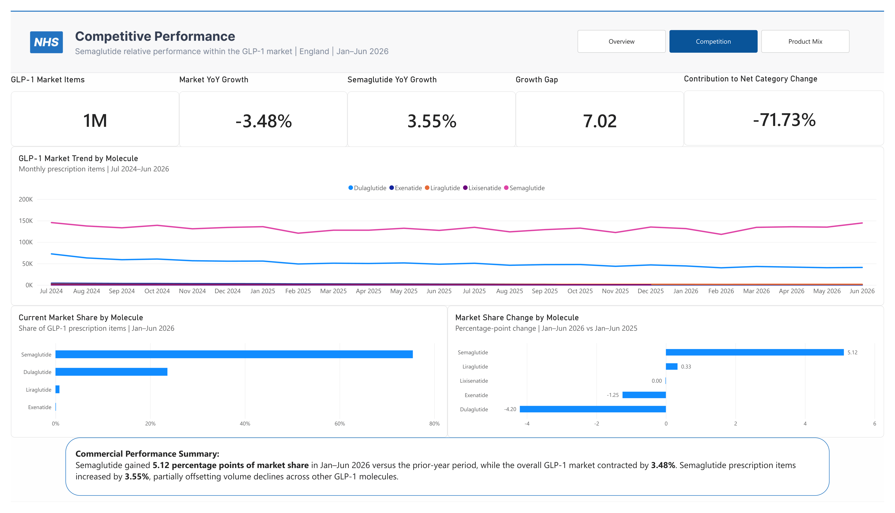
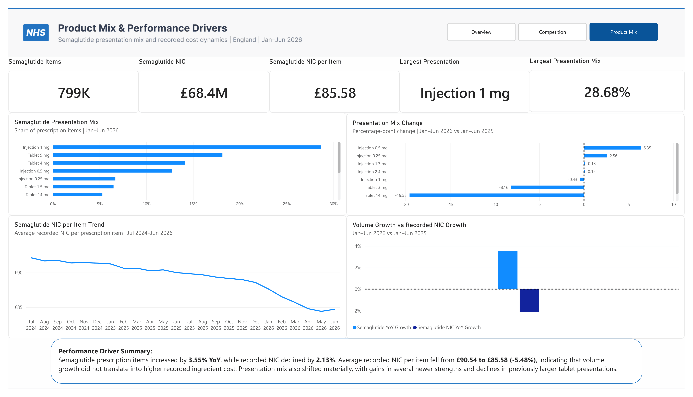

# Semaglutide Commercial Performance Tracker

A Power BI commercial analytics project evaluating semaglutide performance within the English GLP-1 prescribing market, with a focus on prescription volume, competitive market share, product mix, and recorded cost dynamics.

The project uses publicly available NHS prescribing data and applies a commercial analytics lens to answer three core questions:

1. How is semaglutide performing?
2. How is it performing relative to the wider GLP-1 market?
3. What factors appear to be associated with that performance?

---

## Project Overview

This project was designed as a focused pharmaceutical commercial performance tracker.

Rather than building a broad geographic opportunity model, the analysis concentrates on core commercial measures commonly used to monitor product and market performance:

- Prescription Items
- Prescription Volume Growth
- Net Ingredient Cost (NIC)
- NIC Growth
- NIC per Item
- GLP-1 Market Size
- Market Growth
- Market Share
- Market Share Change
- Growth Gap
- Contribution to Net Category Change
- Presentation Mix
- Presentation Mix Change

### Analytical Period

**Primary performance comparison**

> Jan–Jun 2026 vs Jan–Jun 2025

This provides a consistent year-on-year comparison for the 2026 YTD commercial snapshot.

**Historical trend coverage**

> Jul 2024–Jun 2026

The longer historical series is used to provide context for monthly prescribing, market share, and recorded NIC-per-item trends.

---

## Business Question

> How has semaglutide performed within the English GLP-1 prescribing market, and to what extent has its performance been associated with category growth, competitive share change, product mix, and changes in recorded cost per item?

The analysis is structured around three perspectives:

### 1. Product Performance

How has semaglutide prescription volume and recorded cost evolved?

### 2. Competitive Performance

How is semaglutide performing relative to the wider GLP-1 market and competing molecules?

### 3. Performance Drivers

How have presentation mix and recorded NIC per item changed alongside overall semaglutide performance?

---

# Dashboard

The Power BI report contains three analytical pages.

---

## Page 1 — Semaglutide Commercial Performance



The first page provides an executive snapshot of semaglutide commercial performance.

### Headline KPIs

- **Prescription Items:** 799K
- **Items YoY Growth:** +3.55%
- **Recorded NIC:** £68.4M
- **NIC YoY Growth:** -2.13%
- **Market Share:** 75.47%
- **Share Change:** +5.12 percentage points

### Key Visuals

- Monthly Semaglutide Prescribing Trend
- Semaglutide Market Share Trend
- Product Growth vs GLP-1 Market Growth
- Commercial Performance Summary

### Key Insight

Semaglutide prescription items increased by **3.55% YoY**, while the defined GLP-1 market contracted by **3.48%**.

This represented a **7.02 percentage-point growth outperformance** and contributed to a **5.12 percentage-point increase in market share**.

At the same time, recorded NIC declined by **2.13%**, indicating that prescription volume growth did not translate into higher recorded ingredient cost.

---

## Page 2 — Competitive Performance



The second page evaluates semaglutide relative to the wider defined GLP-1 market.

### Headline KPIs

- **GLP-1 Market Items:** 1.06M
- **GLP-1 Market YoY Growth:** -3.48%
- **Semaglutide YoY Growth:** +3.55%
- **Growth Gap:** +7.02 percentage points
- **Contribution to Net Category Change:** -71.73%

### Key Visuals

- GLP-1 Market Trend by Molecule
- Current Market Share by Molecule
- Market Share Change by Molecule

### Key Insight

Semaglutide expanded while the overall defined GLP-1 category contracted.

Its prescription-item growth therefore partially offset declines elsewhere in the market.

The negative contribution-to-net-category-change ratio should not be interpreted as negative product performance. It results from semaglutide adding prescription volume while the total category recorded a net decline.

Semaglutide also strengthened its competitive position, increasing its market share by approximately **5.12 percentage points** compared with the corresponding prior-year period.

---

## Page 3 — Product Mix & Performance Drivers



The third page explores product-level dynamics within semaglutide.

### Headline KPIs

- **Semaglutide Items:** 799K
- **Semaglutide NIC:** £68.4M
- **Semaglutide NIC per Item:** £85.58
- **Largest Presentation:** Injection 1 mg
- **Largest Presentation Mix:** 28.68%

### Key Visuals

- Semaglutide Presentation Mix
- Presentation Mix Change
- Semaglutide NIC per Item Trend
- Volume Growth vs Recorded NIC Growth

### Key Insight

Semaglutide prescription items increased by **3.55% YoY**, while recorded NIC declined by **2.13%**.

Average recorded NIC per item declined from **£90.54 to £85.58**, representing a **5.48% year-on-year decline**.

This divergence indicates that prescription volume growth did not translate into higher recorded ingredient cost.

The analysis also identified material changes in the composition of semaglutide presentations, including gains in several strengths and declines in some previously larger tablet presentations.

These results indicate that overall product performance should be interpreted through a combination of:

- Prescription volume
- Competitive market share
- Presentation mix
- Recorded NIC per item
- Wider category dynamics

The analysis does not attempt to establish formal causality between these factors.

---

# Market Definition

For this project, the defined GLP-1 market includes the following molecules:

- Semaglutide
- Dulaglutide
- Liraglutide
- Exenatide
- Lixisenatide

Semaglutide is treated as the focal product.

A stable market definition is used throughout the analysis to ensure that market size, market share, growth, and competitive comparisons use a consistent denominator.

---

# Data Source

The project uses publicly available prescribing data from the NHS Business Services Authority.

## Primary Dataset

**English Prescribing Dataset**

The dataset contains prescribing activity reported at GP-practice level and includes fields such as:

- Prescribing month
- Chemical substance
- Presentation
- Prescription items
- Quantity
- Total quantity
- Net Ingredient Cost
- Actual Cost
- SNOMED code

For this project, practice-level geography was not required.

The underlying data was therefore aggregated to a monthly presentation-level analytical grain.

---

# Data Preparation

The raw prescribing files contained multiple source schemas across the analytical period.

The preparation workflow therefore included:

1. Importing the relevant monthly prescribing files.
2. Harmonising column names across different source schemas.
3. Standardising date fields.
4. Standardising chemical substance and presentation identifiers.
5. Correcting numeric data types for cost fields.
6. Appending all monthly datasets.
7. Filtering to the defined GLP-1 market.
8. Aggregating practice-level records to monthly presentation level.
9. Creating dimension tables for calendar, chemical substance, and presentation.
10. Validating monthly coverage and commercial measures before dashboard development.

---

## Data Quality Issue Identified During Development

An important quality-control issue was identified during the project.

The initially reused prescribing fact table contained incomplete monthly coverage for the required analytical period.

Rather than continuing with the incomplete dataset, the data pipeline was rebuilt directly from the underlying source files.

Two source schema groups were re-harmonised and appended to reconstruct the complete monthly series.

A second issue was identified in the treatment of financial fields.

`NIC` and `Actual Cost` had initially been converted to whole-number data types during an early Power Query transformation, resulting in loss of decimal precision.

The transformation logic was corrected by parsing these fields as decimal numbers at source level before append and aggregation.

The rebuilt dataset was then validated by comparing:

- Monthly coverage
- Annual prescription-item totals
- NIC totals
- Actual Cost totals
- NIC per Item

This QA process formed an important part of the project and helped ensure that the final commercial measures were based on complete and correctly typed source data.

---

# Data Model

The Power BI model follows a simplified star-schema structure.

## Fact Table

### `Fact_Prescribing`

Contains the monthly presentation-level prescribing measures.

Key fields include:

- YearMonth
- ChemicalSubstanceCode
- Molecule
- PresentationCode
- PresentationName
- Quantity
- Items
- TotalQuantity
- NIC
- ActualCost
- SNOMEDCode

---

## Dimension Tables

### `Dim_Calendar`

Provides time intelligence and sorting fields including:

- YearMonth
- Year
- MonthNumber
- MonthName
- Quarter
- MonthYear
- YearMonthSort

### `Dim_Chemical`

Contains the five GLP-1 molecules and analytical classifications including:

- ChemicalSubstanceCode
- Molecule
- Market
- FocalProductFlag

### `Dim_Presentation`

Contains presentation-level attributes including:

- PresentationCode
- PresentationName
- ChemicalSubstanceCode
- Molecule
- SNOMEDCode
- Formulation
- Strength
- PresentationGroup

---

# Core Measures

Examples of the core DAX measures used in the project include:

```DAX
Total Items =
SUM(Fact_Prescribing[Items])
```

```DAX
NIC =
SUM(Fact_Prescribing[NIC])
```

```DAX
NIC per Item =
DIVIDE(
    [NIC],
    [Total Items]
)
```

---

## Semaglutide Measures

```DAX
Semaglutide Items =
CALCULATE(
    [Total Items],
    Dim_Chemical[FocalProductFlag] = "Yes"
)
```

```DAX
PY Semaglutide Items =
CALCULATE(
    [Semaglutide Items],
    SAMEPERIODLASTYEAR(Dim_Calendar[YearMonth])
)
```

```DAX
Semaglutide YoY Growth =
DIVIDE(
    [Semaglutide Items] - [PY Semaglutide Items],
    [PY Semaglutide Items]
)
```

```DAX
Semaglutide NIC =
CALCULATE(
    [NIC],
    Dim_Chemical[FocalProductFlag] = "Yes"
)
```

```DAX
PY Semaglutide NIC =
CALCULATE(
    [Semaglutide NIC],
    SAMEPERIODLASTYEAR(Dim_Calendar[YearMonth])
)
```

```DAX
Semaglutide NIC YoY Growth =
VAR PreviousNIC =
    [PY Semaglutide NIC]
RETURN
IF(
    NOT ISBLANK(PreviousNIC),
    DIVIDE(
        [Semaglutide NIC] - PreviousNIC,
        PreviousNIC
    )
)
```

```DAX
Semaglutide NIC per Item =
DIVIDE(
    [Semaglutide NIC],
    [Semaglutide Items]
)
```

```DAX
PY Semaglutide NIC per Item =
CALCULATE(
    [Semaglutide NIC per Item],
    SAMEPERIODLASTYEAR(Dim_Calendar[YearMonth])
)
```

```DAX
Semaglutide NIC per Item YoY Growth =
VAR PreviousValue =
    [PY Semaglutide NIC per Item]
RETURN
IF(
    NOT ISBLANK(PreviousValue),
    DIVIDE(
        [Semaglutide NIC per Item] - PreviousValue,
        PreviousValue
    )
)
```

---

# Market Measures

```DAX
GLP1 Market Items =
CALCULATE(
    [Total Items],
    REMOVEFILTERS(Dim_Chemical),
    Dim_Chemical[Market] = "GLP-1"
)
```

```DAX
PY GLP1 Market Items =
CALCULATE(
    [GLP1 Market Items],
    SAMEPERIODLASTYEAR(Dim_Calendar[YearMonth])
)
```

```DAX
GLP1 Market YoY Growth =
DIVIDE(
    [GLP1 Market Items] - [PY GLP1 Market Items],
    [PY GLP1 Market Items]
)
```

```DAX
Semaglutide Market Share =
DIVIDE(
    [Semaglutide Items],
    [GLP1 Market Items]
)
```

```DAX
PY Semaglutide Market Share =
CALCULATE(
    [Semaglutide Market Share],
    SAMEPERIODLASTYEAR(Dim_Calendar[YearMonth])
)
```

```DAX
Share Change (pp) =
VAR PreviousShare =
    [PY Semaglutide Market Share]
RETURN
IF(
    NOT ISBLANK(PreviousShare),
    ([Semaglutide Market Share] - PreviousShare) * 100
)
```

```DAX
Growth Gap (pp) =
VAR ProductGrowth =
    [Semaglutide YoY Growth]
VAR MarketGrowth =
    [GLP1 Market YoY Growth]
RETURN
IF(
    NOT ISBLANK(ProductGrowth)
        && NOT ISBLANK(MarketGrowth),
    (ProductGrowth - MarketGrowth) * 100
)
```

---

# Competitive Market Share Measures

```DAX
Molecule Market Share =
DIVIDE(
    [Total Items],
    CALCULATE(
        [Total Items],
        REMOVEFILTERS(Dim_Chemical)
    )
)
```

```DAX
PY Molecule Market Share =
CALCULATE(
    [Molecule Market Share],
    SAMEPERIODLASTYEAR(Dim_Calendar[YearMonth])
)
```

```DAX
Molecule Share Change (pp) =
VAR PreviousShare =
    [PY Molecule Market Share]
RETURN
IF(
    NOT ISBLANK(PreviousShare),
    ([Molecule Market Share] - PreviousShare) * 100
)
```

---

# Contribution to Net Category Change

```DAX
Semaglutide Absolute Growth =
VAR PreviousItems =
    [PY Semaglutide Items]
RETURN
IF(
    NOT ISBLANK(PreviousItems),
    [Semaglutide Items] - PreviousItems
)
```

```DAX
GLP1 Market Absolute Growth =
VAR PreviousMarket =
    [PY GLP1 Market Items]
RETURN
IF(
    NOT ISBLANK(PreviousMarket),
    [GLP1 Market Items] - PreviousMarket
)
```

```DAX
Semaglutide Contribution to Growth =
VAR ProductGrowth =
    [Semaglutide Absolute Growth]
VAR MarketGrowth =
    [GLP1 Market Absolute Growth]
RETURN
IF(
    NOT ISBLANK(ProductGrowth)
        && NOT ISBLANK(MarketGrowth),
    DIVIDE(
        ProductGrowth,
        MarketGrowth
    )
)
```

Because the GLP-1 market recorded a net decline during the headline period while semaglutide added prescription volume, this ratio is negative.

It should therefore be interpreted as contribution to **net category change**, rather than as a conventional positive growth-contribution metric.

---

# Presentation Mix Measures

```DAX
Presentation Items =
[Semaglutide Items]
```

```DAX
Presentation Mix % =
DIVIDE(
    [Presentation Items],
    CALCULATE(
        [Semaglutide Items],
        REMOVEFILTERS(Dim_Presentation)
    )
)
```

```DAX
PY Presentation Mix % =
CALCULATE(
    [Presentation Mix %],
    SAMEPERIODLASTYEAR(Dim_Calendar[YearMonth])
)
```

```DAX
Mix Change (pp) =
VAR PreviousMix =
    [PY Presentation Mix %]
RETURN
IF(
    NOT ISBLANK(PreviousMix),
    ([Presentation Mix %] - PreviousMix) * 100
)
```

```DAX
Largest Presentation =
VAR T =
    TOPN(
        1,
        ADDCOLUMNS(
            VALUES(Dim_Presentation[PresentationGroup]),
            "ItemsValue",
            [Presentation Items]
        ),
        [ItemsValue],
        DESC
    )
RETURN
MAXX(
    T,
    Dim_Presentation[PresentationGroup]
)
```

```DAX
Largest Presentation Mix % =
VAR LargestGroup =
    [Largest Presentation]
RETURN
CALCULATE(
    [Presentation Mix %],
    Dim_Presentation[PresentationGroup] = LargestGroup
)
```

---

# Commercial Interpretation

The project demonstrates several important principles when interpreting pharmaceutical prescribing data.

## Prescription Items Are Not Patients

A prescription item represents prescribing activity.

It should not be interpreted as a unique patient count.

The dashboard therefore uses terminology such as:

> prescription items increased

rather than:

> patient numbers increased

---

## NIC Is Not Revenue

Net Ingredient Cost is a prescribing-cost measure.

It should not be interpreted as:

- Manufacturer revenue
- Sales revenue
- Net sales
- Average selling price
- Profitability

For this reason, the dashboard refers to:

> recorded NIC

and:

> recorded NIC per prescription item

rather than product price or commercial revenue.

---

## NIC per Item Is a Diagnostic Measure

NIC per Item is calculated as:

> Recorded NIC / Prescription Items

It is used to help understand whether changes in recorded cost are moving proportionally with prescription volume.

It is not treated as a direct pharmaceutical selling-price measure.

---

## Market Share Is Based on Prescription Items

Market share in this project is defined as:

> Molecule prescription items / Total defined GLP-1 prescription items

The metric therefore represents prescribing-volume share within the defined analytical market.

---

## Presentation Mix Is Not Patient Switching

Changes in presentation mix describe changes in the distribution of prescription items across product presentations.

They should not be interpreted as evidence that individual patients switched between formulations or strengths.

The analysis is conducted using aggregated prescribing data and does not include patient-level longitudinal information.

---

# Key Commercial Findings

The 2026 YTD analysis highlights several commercially relevant findings.

### Semaglutide Outperformed the Wider Category

Semaglutide prescription items increased by **3.55% YoY**, while the defined GLP-1 category contracted by **3.48%**.

This created a **7.02 percentage-point growth gap** in favour of semaglutide relative to the wider market.

---

### Competitive Share Strengthened

Semaglutide reached approximately **75.47%** of prescription items within the defined GLP-1 market during Jan–Jun 2026.

Its market share increased by approximately **5.12 percentage points** versus Jan–Jun 2025.

---

### Semaglutide Added Volume Despite Category Contraction

Semaglutide recorded positive prescription-item growth while total GLP-1 market volume declined.

As a result, semaglutide partially offset declines recorded across other molecules within the analytical market.

---

### Recorded NIC Moved Differently from Volume

Semaglutide prescription items increased by **3.55%**, while recorded NIC declined by **2.13%**.

Average recorded NIC per prescription item declined by approximately **5.48%**, from **£90.54 to £85.58**.

This demonstrates why prescription volume and recorded cost should be monitored separately rather than assuming that they move proportionally.

---

### Product Mix Shifted Materially

Injection 1 mg remained the largest semaglutide presentation group, representing approximately **28.68%** of prescription items.

However, the mix analysis also identified material increases and declines across other presentation strengths.

The results suggest that aggregate semaglutide performance reflects not only overall prescription-volume change, but also changes in the composition of the product mix.

---

# Limitations

This project has several important limitations.

## 1. Prescribing Data Is Not Sales Data

The dataset records NHS prescribing activity and associated cost measures.

It does not provide manufacturer-level:

- Sales
- Revenue
- Profit
- Rebates
- Discounts
- Net realised price

---

## 2. Prescription Items Are Not Unique Patients

Multiple prescription items may relate to the same individual.

No patient-level inference is made.

---

## 3. Clinical Indication Is Not Explicitly Modelled

Semaglutide products may be prescribed through different clinical pathways.

The aggregated prescribing dataset does not necessarily allow each prescription item to be assigned reliably to a specific clinical indication.

The project therefore analyses prescribing activity rather than indication-specific demand.

---

## 4. Quantity Is Not the Primary Cross-Product Volume Metric

Quantity definitions may vary across different formulations and presentations.

Prescription Items are therefore used as the primary commercial volume measure.

---

## 5. Defined Market Scope

The analysis uses a defined five-molecule GLP-1 market.

Results therefore describe performance within this analytical market definition and should not automatically be interpreted as the complete pharmaceutical market.

---

## 6. England Scope

The source dataset reflects prescribing activity captured within the English NHS prescribing dataset.

The results should not be interpreted as representing total UK pharmaceutical consumption.

---

## 7. Historical Coverage

The dataset begins in July 2024.

Full-year 2025 versus full-year 2024 comparisons would therefore not represent equivalent periods.

For this reason, the primary headline comparison uses:

> Jan–Jun 2026 vs Jan–Jun 2025

while Jul 2024–Jun 2026 is used primarily for historical trend visualisation.

---

## 8. No Causal Decomposition

The dashboard identifies relationships between:

- Volume growth
- Category performance
- Market share
- Presentation mix
- Recorded NIC per item

These should be interpreted as commercial diagnostics rather than proof that one factor caused another.

---

# Dashboard Design

The dashboard was designed using a combined **Figma + Power BI** workflow.

## Figma

Figma was used to create:

- Dashboard header structure
- Visual identity
- Navigation design
- Static background elements

Rather than designing every chart container in Figma, the project uses Figma primarily as a reusable visual shell.

This maintains design consistency while allowing Power BI visuals to remain flexible and responsive.

## Power BI

Power BI was used for:

- KPI cards
- Line charts
- Bar charts
- DAX measures
- Time intelligence
- Data modelling
- Page navigation
- Commercial summaries

The final dashboard uses three page-navigation buttons:

- **Overview**
- **Competition**
- **Product Mix**

This provides report interactivity while maintaining a focused executive-dashboard structure without unnecessary slicers.

---

# Dashboard Structure

## Overview

Focuses on:

- Semaglutide prescription volume
- YoY growth
- Recorded NIC
- Market share
- Competitive growth gap

## Competition

Focuses on:

- GLP-1 category size
- Molecule trends
- Current market share
- Market share change
- Contribution to net category change

## Product Mix

Focuses on:

- Semaglutide presentation mix
- Presentation mix change
- NIC per item
- Recorded cost dynamics
- Volume versus NIC growth

---

# Tools & Technologies

- **Power BI**
- **Power Query**
- **DAX**
- **Figma**
- **NHSBSA English Prescribing Dataset**
- **GitHub**

---

# Skills Demonstrated

This project demonstrates practical experience in:

- Pharmaceutical commercial analytics
- Market performance analysis
- Competitive analytics
- Market share analysis
- Product mix analysis
- Time-series analysis
- Commercial KPI development
- DAX
- Power Query
- Data modelling
- Data quality assurance
- Dashboard design
- Figma-to-Power-BI workflow
- Commercial interpretation
- Analytical storytelling
- Data visualisation

---

# Repository Structure

```text
Semaglutide-Commercial-Performance-Tracker/
│
├── README.md
│
├── dashboard/
│   ├── page-1-overview.png
│   ├── page-2-competition.png
│   └── page-3-product-mix.png
│
├── data/
│   └── README.md
│
├── powerbi/
│   └── Semaglutide_Commercial_Performance_Tracker.pbix
│
└── report/
    └── Semaglutide_Commercial_Performance_Tracker_Report.pdf
```

---

# Project Files

## Power BI Report

The `.pbix` file contains the complete analytical model, DAX measures, report pages, and page navigation.

See:

`powerbi/Semaglutide_Commercial_Performance_Tracker.pbix`

---

## Dashboard Images

Dashboard screenshots are available in:

`dashboard/`

Files:

- `page-1-overview.png`
- `page-2-competition.png`
- `page-3-product-mix.png`

---

## Data Documentation

Due to the size of the original monthly NHS prescribing datasets, raw source files are not stored directly in this repository.

Data source, scope, market definition, and preparation information are documented in:

`data/README.md`

---

# Author

**Razaqa Muhammad Hanif Subagyo**

MSc Management of Information Systems & Digital Innovation  
Warwick Business School  
University of Warwick

Commercial Analytics | Business Analysis | Power BI | Digital Innovation

GitHub: [github.com/razaqasubagyo](https://github.com/razaqasubagyo)

---

# Related Projects

## UK Pharmaceutical Commercial Analytics — SGLT2 Market

Commercial analytics project examining SGLT2 prescribing performance, market share, growth, and geographic variation across England.

[View Project](https://github.com/razaqasubagyo/UK-Pharmaceutical-Commercial-Analytics-SGLT2-Market)

---

## UK GLP-1 Commercial Opportunity & Disease Burden Analysis

Power BI analysis integrating NHS prescribing, GP population, and QOF diabetes data to evaluate GLP-1 market performance, disease-adjusted utilisation, competitive dynamics, and commercial opportunity.

[View Project](https://github.com/razaqasubagyo/UK-GLP1-Commercial-Opportunity-Disease-Burden-Analysis)

---

# Disclaimer

This project was developed independently for educational and portfolio purposes using publicly available NHS data.

It is not affiliated with, endorsed by, or produced on behalf of the NHS, any pharmaceutical manufacturer, or any commercial organisation.

The analysis is intended to demonstrate data analytics, Power BI, commercial reasoning, data-quality assurance, and dashboard-design capabilities.

It should not be interpreted as clinical, financial, commercial, or investment advice.
